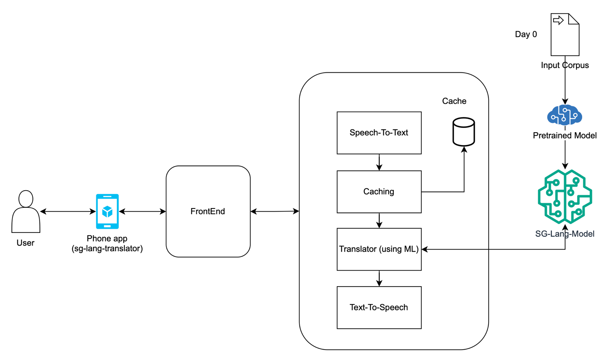

# sg-lang-translator
## Goal
AI/ML based Language translator for languages(dialects) spoken in South Gujarat(India). Translation include audio-to-audio, text-to-audio, audio-to-text with current focus on audio-to-audio with future feature enhancements.

## High Level Architecture

## Considerations
- Modularity: Keep the code as modular/abstract as possible. We may need to try out few different tools to achieve same functionality.
- Scale: ~3M people speaking different languages. Even 5% of them using the app on daily basic would translate to 150K DAU. That would translate to ~1.7 TPS.
- Latency: yet to be determined as backend components are not finalized. Ideal 1-2 seconds on average.
- Cost: Some components(especially Speech to Text, Hosting) can incur cost. Goal is to use free tools or minimal cost tools to achieve the desired result. Depending on the success of the project, we can revisit.
- Cache: Frequently spoken text can be cached on the backend considering time taken to do speech to text to speech again.
- Community: Make it open to public. Build feedback loop. Crowdsourcing for input corpus and continous training the model.
